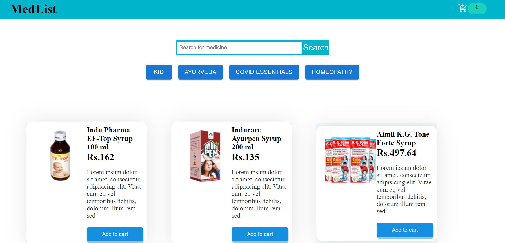
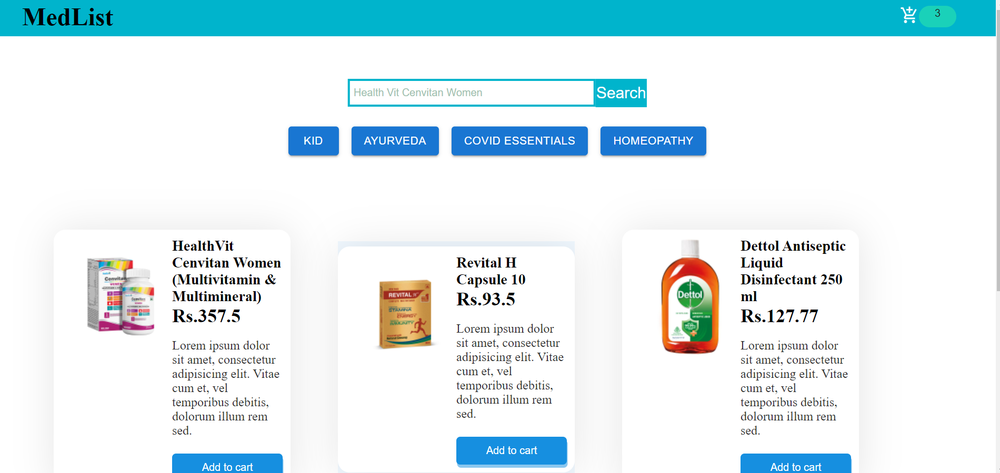
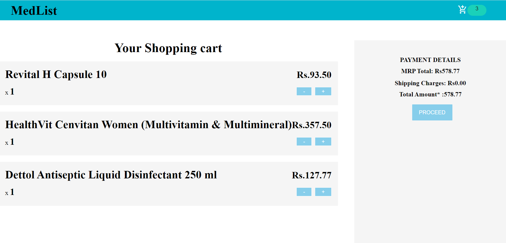

# **MEDICINE App**
Its basically an medicine app which is based on different category such as Kid, Covid Essentials, Herbal etc. By clicking on different button we can see details of that particular category. We can search item by writing their name into the search bar. The item we selected is added into the cart. In cart we can see details of our items.

### Trainer target
- State management with react reducers
- Learn to implement hooks like useState, useEffect()
- Filter method
- Working on Redux
- Different uses of javascript methods

## Tech stack
### _Language_: Javascript, Html, Css, MaterialUI
### _Package management_: NPM
### _Frameworks_/ _Library_: React
### _Third party library_: Redux

## Trainee Achieved
- Getting knowledge of using hooks
- Using of Redux
- Passing of data in components using props 
- Making of components
- Learn React Reducers
